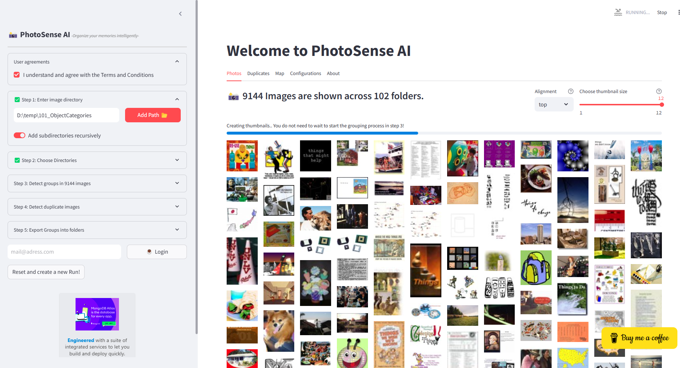
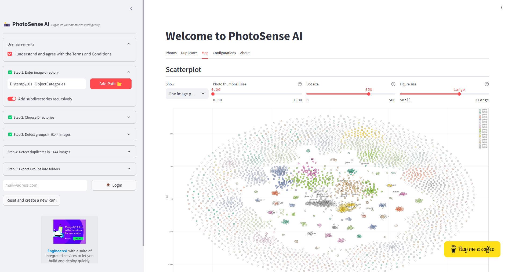

Scenes images (Medium dataset)
################################

In this section, we will use toy datasets for demonstration purposes.

A small dataset containing three categories is the **Scenes** 
`toy-example dataset <https://github.com/erdogant/erdogant.github.io/blob/master/datasets/scenes.zip?raw=true>`_  
This dataset contains a few hundred images over 3 categories which can be used to cluster based on the picture content.

.. |figE1| image:: ../figs/photosense_main.png

.. table:: Scenes Data Set
   :align: center

   +----------+
   | |figE1|  |
   +----------+
   

.. raw:: html

    <video width="720" height="400" controls>
        <source src="https://raw.githubusercontent.com/erdogant/PhotoSenseAI/main/docs/figs/export.webm" type="video/webm">
        Your browser does not support the video tag.
    </video>
    

Caltech 101 (very large dataset)
###################################

A large dataset is the `Caltech 101 objects dataset <https://data.caltech.edu/records/mzrjq-6wc02/files/caltech-101.zip?download=1>`_.
The dataset contains 9,144 real-world images belonging to 101 categories.
About 40 to 800 images per category. The size of each image is roughly 300 x 200 pixels and can be downloaded at the Caltech website.
When we add the directory of the images to PhotoSense AI, all images in subdirectories will be recursively collected and processed.

.. note::

    Read the blog `Step by step guide to clustering images <https://medium.com/towards-data-science/a-step-by-step-guide-for-clustering-images-4b45f9906128>`_ for more details.

On my machine (32GB internal memory), this amount of images is clearly the limit of what can be analyzed.
One way to keep going is to lower the thumbnail resolution to 64 in the configurations to prevent out-of-memory issues.
However, when doing so, the low-resolution images will have a negative impact on the accuracy of the clustering results.
After waiting a couple of minutes, the thumbnails were loaded and could be clustered on **Picture Content** in Step 3.

.. table:: Caltech Data Set
   :align: center

   +----------+
   | |figE2|  |
   +----------+
   | |figE3|  |
   +----------+

.. raw:: html

    <video width="720" height="400" controls>
        <source src="https://raw.githubusercontent.com/erdogant/PhotoSenseAI/main/docs/figs/caltech_dataset_load.webm" type="video/webm">
        Your browser does not support the video tag.
    </video>

.. include:: add_bottom.add