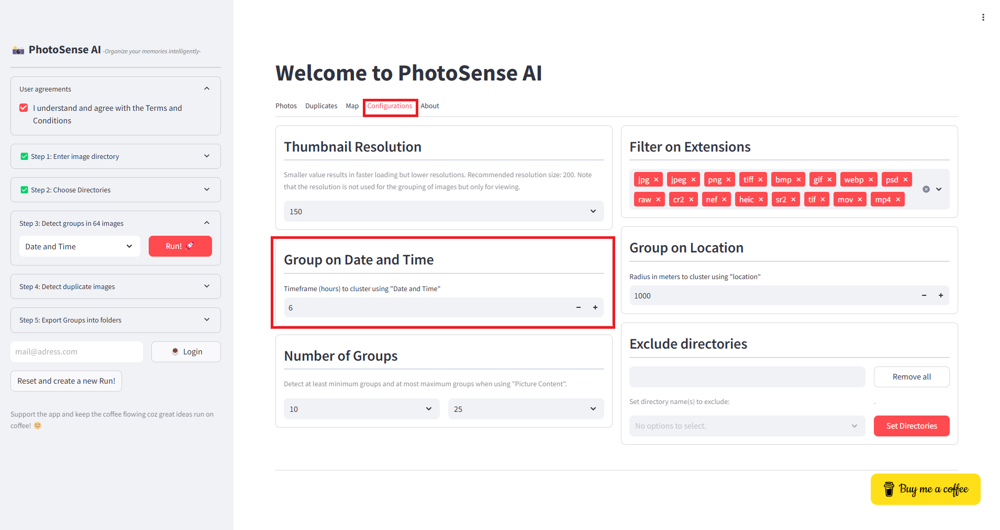
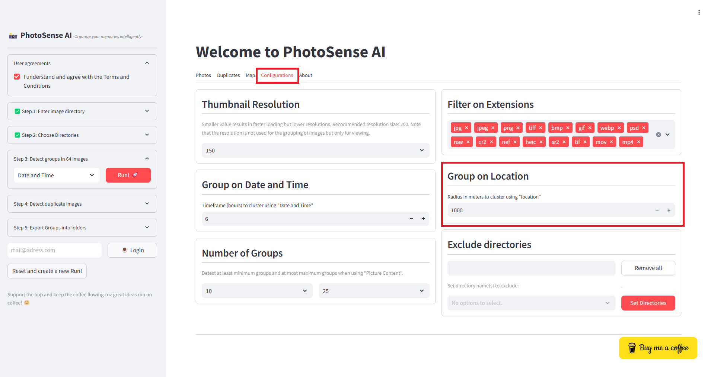

Date and Time
'''''''''''''''''''

Imagine you have created various photos, and friends/family also took photos of the same event but at different locations. Using a 1-hour clustering window (or more), you can now easily group photos taken within an hour of each other. This helps identify bursts of activity, such as when a user takes multiple pictures in a short period.

**How It Works**

All date and time information is extracted from the images, and once the timestamps are transformed, a clustering algorithm is applied to find clusters of timestamps that are within the specified time window.

This technique is useful in applications where you need to group images that belong to the same event but were taken at different locations over time.

Each timestamp is assigned a cluster label, where the same label means the timestamps belong to the same cluster, and a group label of -1 indicates that the timestamp is considered an outlier (not part of any cluster).

.. table:: Configuration for the time-window setting
   :align: center

   +----------+
   | |fig5|   |
   +----------+

Location
'''''''''''''''''''

Location-based clustering helps group photos taken near each other using their latitude and longitude coordinates.
This is useful for organizing travel photos, detecting hotspots, and identifying repeated locations in a collection.

**How It Works**

Many photos store latitude and longitude in their metadata. These values are used as input for clustering.
The clustering algorithm groups points that are within a certain distance of each other. Unlike time-based clustering, location clustering uses the haversine distance, which accounts for the Earth's curvature.
Photos taken within the configured distance range receive the same cluster label, while isolated photos remain unclustered.

.. table:: Configuration for the time-window setting
   :align: center

   +----------+
   | |fig6|   |
   +----------+
    

Picture Content
'''''''''''''''''''

Each photo is represented by thousands of pixel intensity values. By clustering on picture content, we can use the most important components that capture the most variation.
This is useful for image deduplication, organizing albums by visual similarity, and finding groups of similar-looking photos, such as sunsets, landscapes, or portraits.

.. include:: add_bottom.add