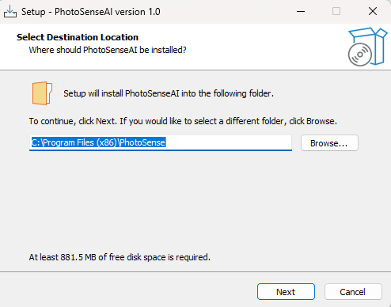
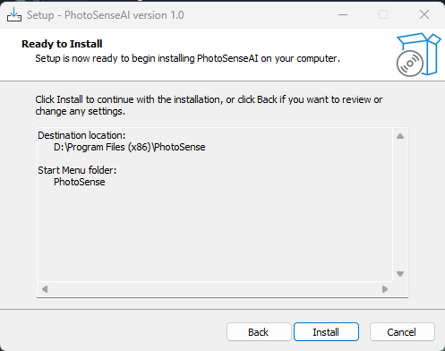
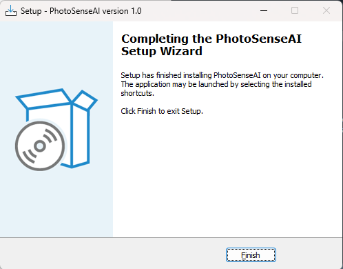
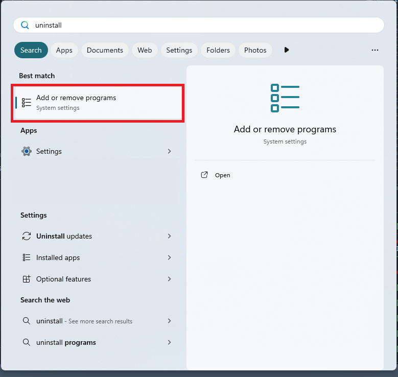
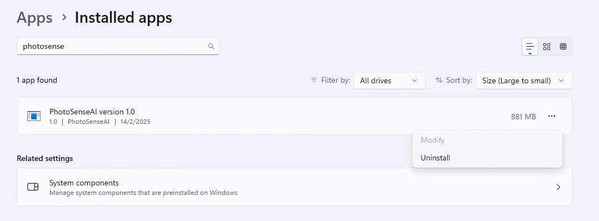

Installation
################

After downloading ``PhotoSenseAI``, it can be installed by double-clicking on the file to start the regular Windows installation wizard.
After following the steps in the installation wizard, ``PhotoSenseAI`` will be installed on disk for local use.

.. table:: Installation steps
   :align: center

   +----------+----------+----------+
   | |fig2a|  | |fig2b|  | |fig2c|  |
   +----------+----------+----------+

Now start the application by opening the Start menu and searching for *PhotoSenseAI*. Click on the application icon that appears under the installed programs. Alternatively, you can find it in the *PhotoSense* folder within the Start menu. If you created a desktop shortcut during installation, you can also double-click the shortcut to launch the application.
Please note that the first time you start PhotoSenseAI, the loading process may take a few minutes. This is because the application needs to initialize necessary components and load required resources. Future launches will be faster.

Uninstalling
################

Removing the installation of ``PhotoSenseAI`` can be done using the normal windows procedure. 
In your Start menu, search for *Add or remove programs* and open the system settings. Scroll through the list of installed applications or use the search bar to find *PhotoSenseAI*. Click on it, then select *Uninstall* and follow the on-screen instructions to complete the removal.

.. table:: Removing steps
   :align: center

   +----------+----------+
   | |fig3a|  | |fig3b|  |
   +----------+----------+

.. include:: add_bottom.add