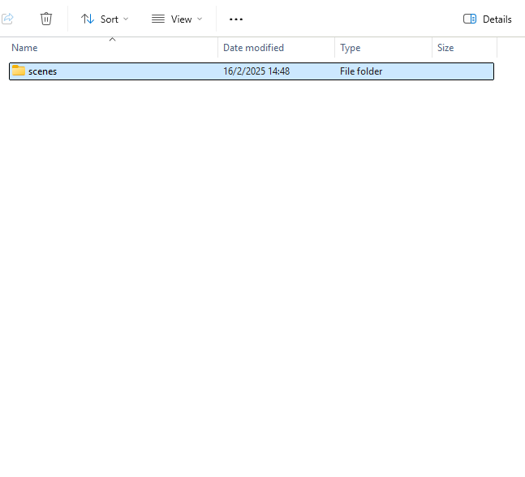
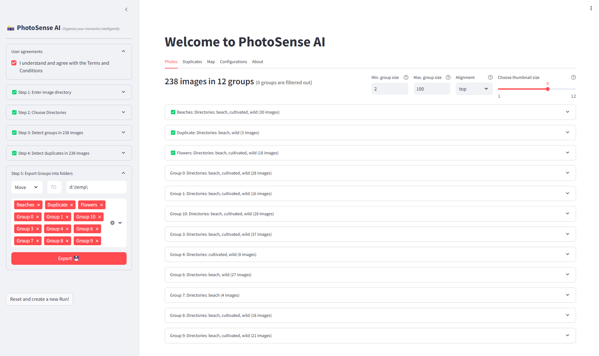
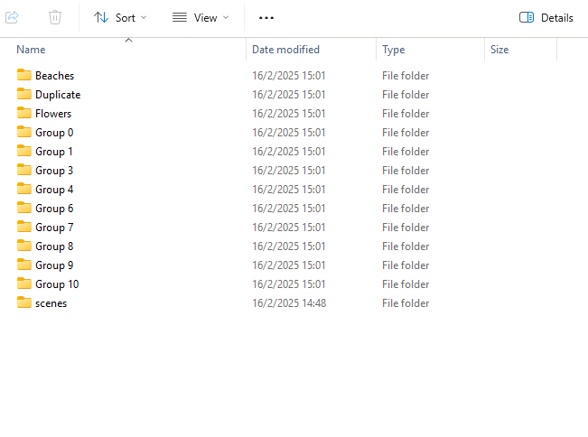

Import Images
##############

Choose Directories
'''''''''''''''''''''''''''''''''''''''''''

After specifying the main image directory in Step 1, you can refine the selection by choosing specific subdirectories to include in the analysis. Each selected folder will be scanned for images, and if the Add subdirectories recursively option is enabled, all nested folders within the selected directories will also be included.
Once you add a directory, it will appear in a list under Step 2. This list helps you keep track of the selected directories and ensures that only relevant folders are processed. You can add multiple directories to organize your image selection more effectively.

.. tip::

	* If you have various directories, simply enter them one-by-one and all images will be added for selection in step 3.

.. |fig4| image:: ../figs/step23_sidebar.png

.. table:: Selection of directories
   :align: center

   +----------+
   | |fig7a|  |
   +----------+
   | |fig4|   |
   +----------+

Manage Selected Directories
'''''''''''''''''''''''''''''''''''''''''''
Step 3 allows you to review and modify the selected directories before proceeding. Each directory has a red ❌ button next to it, which enables you to remove that specific directory from the selection. If you want to clear all selected directories at once, you can use the Remove all directories button.

By carefully managing your selected directories, you can control which images will be processed and analyzed. This is particularly useful when working with large datasets or when you need to focus on specific image collections.

Export Images
##############

After you have organized your photos into albums and labeled the duplicate images, it is time to export or re-organize the images on disk.
In step 5 we can either ``COPY`` or ``MOVE`` the images to a destination directory based on the selected group-labels.

.. table:: Import and export images
   :align: center

   +----------+
   | |fig7b|  |
   +----------+
   | |fig7c|  |
   +----------+

.. warning::

    The Export functionality will physically move or copy the photos on your disk. 

.. include:: add_bottom.add